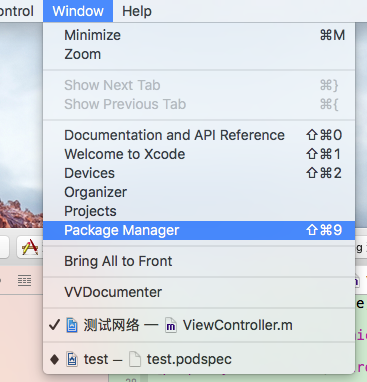
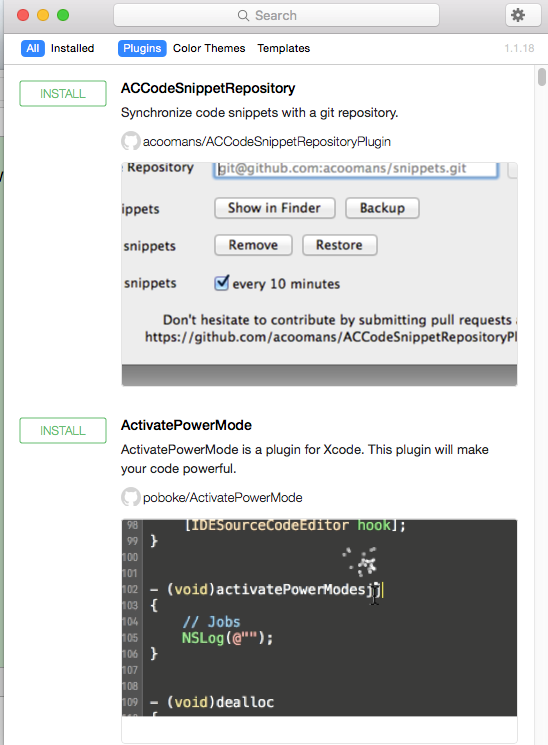
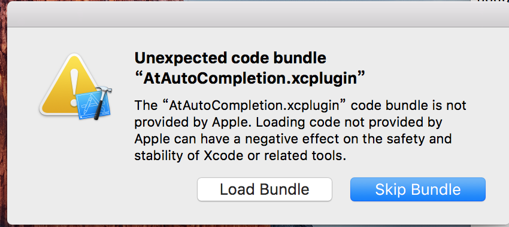

## 目录

[**1 引言**](#1-引言)

- [1.1 培训目的](#11-培训目的)
 
- [1.2 参考资料](#12-参考资料)
 
- [1.3 术语和缩写词](#13-术语和缩写词)

[**2 安装`Cocoapod`**](#2-安装cocoapod)

- [2.1 通过终端安装](#21-通过终端安装)

- [2.2 使用`Alcatraz`安装](#22-使用Alcatraz安装)

[**3 使用`Cocoapods`**](#3-使用cocoapods)

[**4 创建私有仓库,并支持`cocoapods`**](#4-创建私有仓库,并支持cocoapods)

[**5 `Cocoapods`下载框架中资源文件获取问题**](#5-cocoapods下载框架中资源文件获取问题)

## <a id="1-引言"></a>1 引言

### <a id="11-培训目的"></a>1.1 培训目的
　　
　　帮助开发人员安装`Cocoapods`且学会使用`Cocoapods`管理公共类库,进一步学会封装公共类库并使其支持`Cocoapods`.
　　
### <a id="12-参考资料"></a>1.2 参考资料

　　[1. 从零开始，让你的框架支持CocoaPods！](http://www.cocoachina.com/ios/20160415/15939.html)


　　[2. Cocoapods官网！](https://www.cocoapods.org)
　　
　　

### <a id="13-术语和缩写词"></a>1.3 术语和缩写词
　　无

## <a id="2-安装cocoapod"></a>2 安装`Cocoapod`

### <a id="21-通过终端安装"></a>2.1 通过终端安装

　　`Pods`，基于`Ruby`环境的一个`iOS`开发利器,安装`cocoapod`有两种方法,一种是通过终端使用命令行来安装,另一种是通过插件安装.

 - 查看电脑是否安装`Pods`
 
```
$ which pod
```
    
    
 - 如果有安装,结果如下,反之控制台无输出

```
/usr/local/bin/pod
```

- 如果没有安装,则通过以下命令安装:

```
$ sudo gem install cocoapods
```
    
- 因为`cocoapods.org`被和谐了,所以直接这样安装会很慢,所以我们要移除`gem`访问`cocoapod`的网址:
    
```
$ gem sources --remove https://rubygems.org/
```
    
- 通过淘宝`Ruby`镜像来安装:
    
```
$ gem sources -a https://ruby.taobao.org/
```
    
- 验证所设置的`Ruby`镜像:

```
$ gem sources -l
```
    
- 感觉可以了,那么我们就开始安装:

```
$ sudo gem install cocoapods
```
    
安装成功就可以使用了.

### <a id="22-使用Alcatraz安装"></a>2.2 使用`Alcatraz`安装

　　通过终端安装`cocoapods`感觉还是有点麻烦,那么现在我们来介绍另一种安装方法:使用[**`Alcatraz`**](https://github.com/alcatraz/Alcatraz.git)安装Pods插件.
　　**`Alcatraz`**是一个能帮你管理`Xcode`插件丶模版及颜色配置的工具.它可以直接集成在`Xcode`的图形界面中,让你感觉就像在使用`Xcode`自带的功能一样.


- 安装`Alcatraz`

```
$ curl -fsSL https://raw.github.com/supermarin/Alcatraz/master/Scripts/install.sh | sh
```

- 删除`Alcatraz`
        
```
$ rm -rf ~/Library/Application\ Support/Developer/Shared/Xcode/Plug-ins/Alcatraz.xcplugin 
``` 
        
- 删除所有通过`Alcatraz`安装的安装包 

```
$ rm -rf ~/Library/Application\ Support/Alcatraz/
```
        
- 如果用命令安装`Alcatraz`不成功,那么还有一个更方便的方法,通过`github`下载`Alcatraz`源码,直接运行一次就可以了.

- 使用`Alcatraz`

     

- 搜索插件
    
    
    
- 搜索`cocoapod`点击`install`,安装完成后重启`Xcode`,选择`load Bundle`就可以使用了.
    
    
    
### <a id="3-使用cocoapods"></a>3 使用cocoapods

- 查找第三方库
    
```
$ pod search projectname
```

- 使用vim编辑`profile`文件 

```
$ vim profile
```          
        
- `profile`内容,由于我们的库是私有库,因此需要在`profile`中添加我们的资源路径
    
```
source 'git@codesync.cn:iOS/Minstone-Specs.git'
source 'git@codesync.cn:iOS/CocoaPods-Specs.git'
platform :ios, "8.0"
pod 'projectname', '~> 1.0.2’
    
```

- 下载第三方库


```
$ pod install
```
　　由于使用`pod install`或者`pod update`时,会升级`Cocoapods`的`spec`仓库,那样会使得我们安装或更新变慢.然而我们不想等那么久,那么可以通过以下命令:
    
```
$ pod install --no-repo-update
$ pod update --no-repo-update
```
    

## <a id="4-创建私有仓库,并支持cocoapods"></a>4 创建私有仓库,并支持`Cocoapods`


- 创建`cocoapod`工程

```
$ pod lib create yourname

接着会有以下提示:
    What language do you want to use?? [ Swift / ObjC ]
 > objc
    
Would you like to include a demo application with your library? [ Yes / No ]
 > yes
    
Which testing frameworks will you use? [ Specta / Kiwi / None ]
 > none
    
Would you like to do view based testing? [ Yes / No ]
 > no
    
What is your class prefix?
 > MD
 
 第一个是选择语言,通常我们都是选objc;
 第二个是创建一个demo工程;
 后面的选none和no,因为不需要用到这些框架;
 前缀使用公司名称缩写:MD.
 生成新工程以后,会执行pod install命令,如果太慢或者被墙了,可以ctrl+c中断它,然后执行下面的命令:
 $ pod update --no-repo-update
 
```
    
- 配置`podspec`文件

```
注:1.这是pod的说明文件,务必仔细阅读此文件的注释,因为podspec没有配置好的话会直接影响你的库能不能支持cocoapods.
   2.必须明确source_files里的是{h,m}文件,因为xib不能包含在此目录!
   3.资源文件必须放在Assets目录下.


Pod::Spec.new do |s|
s.name             = "test" #名称
s.version          = "1.0.2" #版本号
s.summary          = "A test of cocoapod." #简短的介绍

s.description      = <<-DESC 
                    A test of suport cocoapod.
                   DESC  #详细的描述

s.homepage         = "http://codesync.cn/xutzh/test"  #主页,这里要填写可以访问到的地址,不然验证不通过.
s.license          = 'MIT'  开源协议
s.author           = { "xutzh" => "xutzh@minstone.com.cn" } #作者信息
s.source           = { :git => "http://codesync.cn/xutzh/test.git", :tag => s.version.to_s } #项目地址,这里不支持ssh地址,验证不通过,只支持http和https
#s.social_media_url = 'http://' #多媒体地址,非必要项
s.ios.deployment_target = '8.0'  #部署目标版本

s.source_files = 'test/Classes/**/*.{h,m}' #代码源文件地址,**/*表示Classes目录及其子目录下所有文件,如果有多个目录下则用逗号分开,如果需要在项目中分组显示,这里也要做相应的设置(必须明确source_files里的是{h,m}文件,因为xib不能包含在此目录!)
s.resource     = "test/Assets/*.{bundle,xib,html}" #资源文件地址
s.public_header_files = 'test/Class/**/*.h' #公开头文件的地址
s.frameworks = 'PSKit','UIKit' #所需的framework,多个则用逗号隔开
s.library = "sqlite3"  #指定导入的库，比如sqlite3,多个则改为s.libraries,并且用逗号隔开,如: s.libraries = 'xx','xx'
s.dependency 'AFNetworking', '~>3.0' #依赖关系，该项目所依赖的其他库，如果有多个需要填写多个s.dependency
s.requires_arc = true  #是否使用ARC，如果指定具体文件，则具体的问题使用ARC
end

```
    

    
- 添加资源文件到相应目录下
本地检查`podspec`:

```
$ pod lib lint

#如果项目里面有引用PSKit等私有库，则需要加上资源路径,如：
$ pod lib lint --sources='git@codesync.cn:iOS/CocoaPods-Specs.git,git@codesync.cn:iOS/Minstone-Specs.git' --allow-warnings
```
        
    

- 提交工程到`git`仓库

```
$ git add .
$ git commit -m "初始化项目"
```

- 在`git`仓库创建`tag`

```
$ git tag '1.0.0'
$ git push --tags
$ git push origin master
```

- 在`Minstone-Specs`创建资源索引

```
├── Minstone-Specs
   ├── Specs
    　├── PSKit
    　  ├── 1.0.0
```
- **2016/6/6更新,更加轻松地使我们的库支持Cocoapods:**

由于我们的私有库是从Minstone-Specs去搜索podspec.json文件的,因此,我们往Minstone-Specs添加对应版本的podspec.json后,也就是说Cocoapods已经可以从Minstone-Specs里面找到我们的私有库了.那么,我们就不需要再执行'pod repo add'这个命令让我们的私有repo添加到Cocoapods中了.当我们需要使用新增的私有库时,我们只需要更新Minstone-Specs,即:

```objc
$ pod repo update Minstone-Specs
```
这样我们就能使用新增的私有库了.说了那么多,我们来举个栗子:

```objc
1.提交工程到GitLab
2.合并到主分支后打上tag
3.把`podspec`转成`podspec.json`文件
$ pod ipc spec name.podspec >> name.podspec.json
4.在Minstone-Specs创建对应版本的文件夹,里面存放podspec.json文件并提交到GitLab
5.最后更新Minstone-Specs,如果其他同事要使用该库,只需要执行这一步即可
$ pod repo update Minstone-Specs

以下支持cocoapods私有库的方法可以直接忽略,请使用更加轻松的方法.

```
- 至此,我们自制的库就完成了,通过`pod search`命令就可以搜索到我们的库了.这是添加到私有的`Repo`,如果要添加到`Cocoapods`的官方库,则需要注册`cocoaPods`账号:
    	
```
$ pod trunk register 邮箱地址 '用户名' --description='描述信息'
```
        
* 查看个人CocoaPods账号信息
 
```
$ pod trunk me
``` 
            
* 上传代码到`cocoapods`之前,需要验证自己的podspec文件格式的有效性，终端命令如下

```
$ pod spec lint
```


    
* 通过验证则会显示以下信息,如果不通过则会有相应错误提示

    

```
 -> MDTest (1.0.0)
Analyzed 1 podspecs.
All the specs passed validation.
    
除了以上信息,也很经常会遇到这种情况:
1 out of 2 specs failed validation.
这是个神奇的错误,可以无视他,但是其他错误就要改过来.
```
    
- 通过验证后,将我们的库添加到`Cocoapods`


```
$ pod trunk push MDTest.podspec --allow-warnings
```
    
    
添加成功后以及搜索`MDADView`的信息
    
    
       
        
- 更新代码,更新代码的步骤和创建库的步骤是一样的,在提交新代码后,创建新的`tag`,执行第九步的命令后就可以了.

## <a id="5-cocoapods下载框架中资源文件获取问题"></a>5 Cocoapods下载框架中资源文件获取问题

- 在`Cocoapods`下载框架中,如果里面包含了`xib`文件, 那么我们平常初始化`xib`的代码便不能正常工作了.

```
NSArray *xibArr = [[NSBundle mainBundle] loadNibNamed:NSStringFromClass([MDADViewController class]) owner:self options:nil];
```

- 因为通过`mainBundle`不能获取到我们的`xib`了，解决方法如下

```
NSArray *xibArr = [[NSBundle bundleForClass:[self class]] loadNibNamed:NSStringFromClass([MDADViewController class]) owner:self options:nil];
```

  这样,无论是通过`copy`的方式,还是通过`Cocoapods`安装的方式都能正常加载`xib`文件了.
  
- 至于图片资源,我们可以通过创建一个`bundle`文件,删除`bundle`携带的无用文件，把图片资源添加到`bundle`资源内,方便我们获取.

```
command+N -> Resource -> Settings Bundle
```
    
-  获取图片路径,例如当把图片资源放在MDWebView.bundle时:

```
#define MDWebViewSrcName(file) [@"MDWebView.bundle" stringByAppendingPathComponent:file]
#define MDWebViewFrameworkSrcName(file) [@"Frameworks/MDWebView.framework/MDWebView.bundle" stringByAppendingPathComponent:file]

[UIImage imageNamed:MDWebViewSrcName(@"backIcon.png")] ?: [UIImage imageNamed:MDWebViewFrameworkSrcName(@"backIcon.png")]
```
 
 
